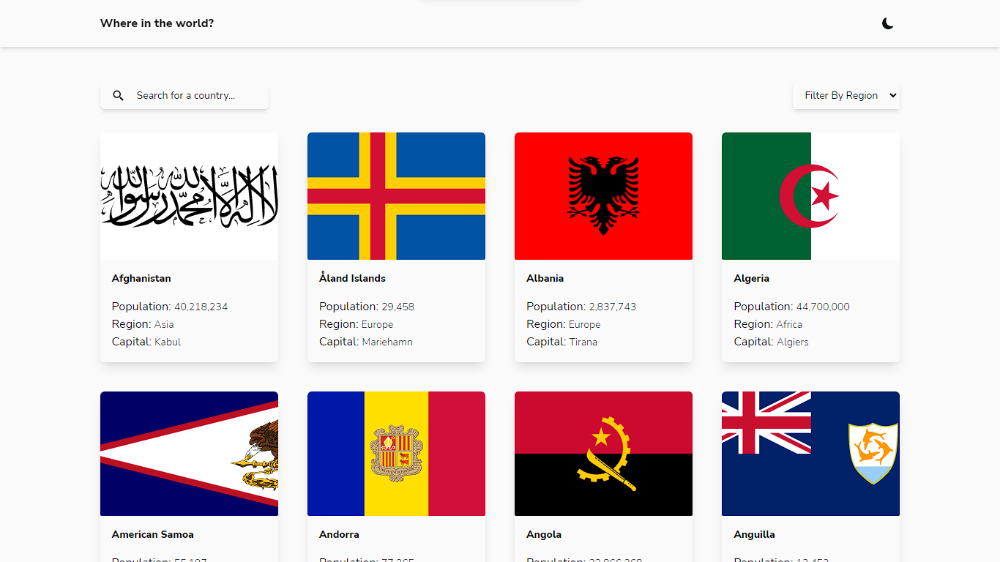

# Frontend Mentor - REST Countries API with color theme switcher solution
 


<div align="center">
  <h3>
    <a href="https://sumaiyakawsar.github.io/rest-api-countries-react/">
      Demo
    </a>
    <span> | </span>
    <a href="https://github.com/sumaiyakawsar/rest-api-countries-react">
      Solution
    </a>
    <span> | </span>
    <a href="https://www.frontendmentor.io/challenges/rest-countries-api-with-color-theme-switcher-5cacc469fec04111f7b848ca">
      Challenge
    </a>
  </h3>
</div>


## Overview
Frontend Mentor challenges help you improve your coding skills by building realistic projects. 
### The challenge

Users should be able to:

- See all countries from the API on the homepage
- Search for a country using an `input` field
- Filter countries by region
- Click on a country to see more detailed information on a separate page
- Click through to the border countries on the detail page
- Toggle the color scheme between light and dark mode 

### Screenshot





## My process

### Built with

- Semantic HTML5 markup
- CSS custom properties
- CSS Grid/Flex
- Mobile-first workflow
- [React](https://reactjs.org/)
- [Tailswind](https://tailwindcss.com/?)
- [Axios](https://axios-http.com/)

### What I learned

- How to get the nested element from an API
- Real-time search (debounced)
- Handled some problematic pages with some missing info (eg: Antarctica)
- Sort alphabetically
```js
 res.data.sort((a, b) => a.name.common.localeCompare(b.name.common))
      
```

### Continued development
 - Add Animation/Motion next

### Useful resources

- [Real-time search](https://javascript.plainenglish.io/how-to-create-an-optimized-real-time-search-with-react-6dd4026f4fa9) - This amazing article helped me to finally understand why debouncing was needed. I really liked it and will use it going forward.I'd recommend it to anyone still learning this concept.
- [Sorting Alphabetically](https://stackoverflow.com/questions/68214368/react-app-how-do-you-map-and-sort-titles-in-an-api-array-in-alphabetical-order) - Ofcourse Stackoverflow. Bestie of all the developers out there.


## Author

[](https://www.frontendmentor.io/profile/sumaiyakawsar) [](https://twitter.com/SumaiyaKawsar_)